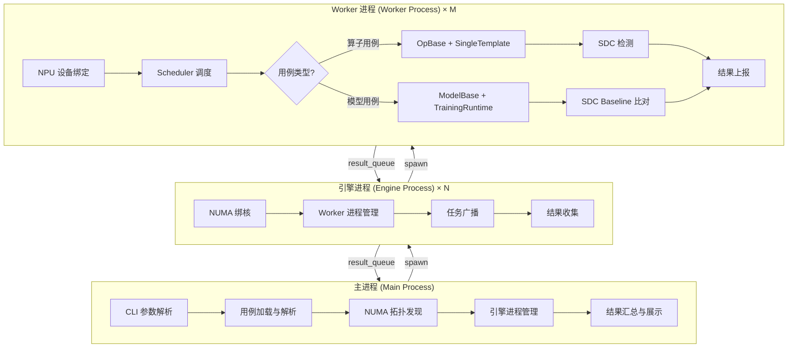
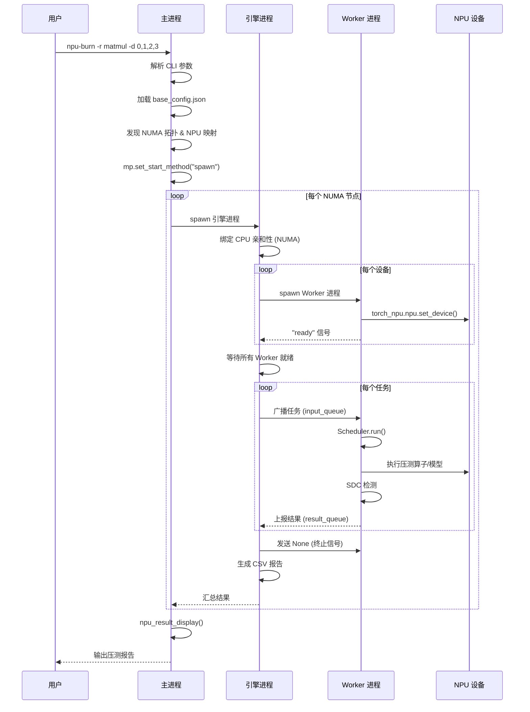
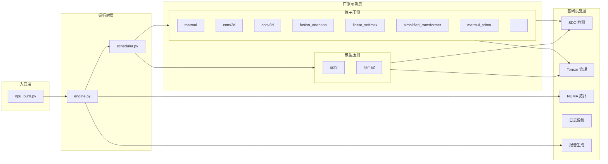
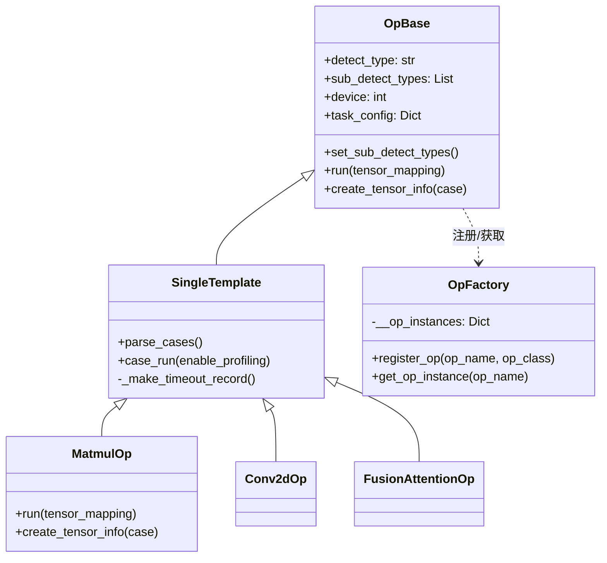
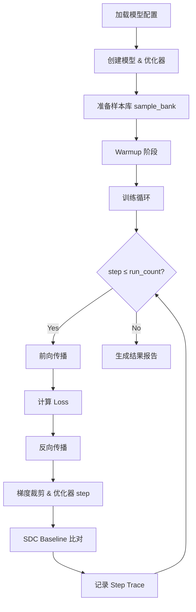
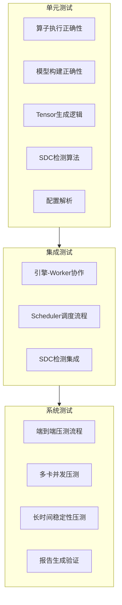

**状态 (Status):** Draft  
**作者 (Authors):** @yangpeng197  
**创建日期 (Created):** 2026-05-07  
**更新日期 (Updated):** 2026-05-07  
**相关 Issue/PR:** #1  

---

# 1. 概述

## 1.1 简介

本提案描述了 **MindCluster-AscendNPUBurn** 项目的设计方案——一个面向华为昇腾（Ascend）NPU 芯片及高速链路的硬件故障压测与检测工具。该工具通过在 NPU 上执行高强度的算子级和模型级压测用例，持续施加计算与带宽压力，同时内置 SDC（Silent Data Corruption，静默数据损坏）检测机制，能够有效暴露芯片在长时间高负载下的硬件缺陷（如计算单元异常、显存位翻转、链路传输错误等），为大规模集群部署前的硬件质量验证提供关键保障。

## 1.2 动机

随着AI硬件在制造工艺与运行架构层面的复制性持续提升，其可靠性已成为待解决的关键问题，硬件故障是导致训练中断和数据损坏的主要因素之一。当前痛点包括：

- **静默数据损坏难以发现**：NPU 计算单元或显存出现偶发位翻转时，不会产生任何异常信号，但会导致模型训练结果偏移，且难以溯源到硬件层面。某客户在 1024 卡集群上训练大模型时，因单卡 SDC 导致整个 checkpoint 作废，损失超过 48 小时的算力成本。
- **缺乏统一的压测工具**：现有压测方案零散，缺乏对算子、模型等多维度的统一覆盖，无法系统性地验证硬件可靠性。
- **NUMA 感知不足**：多卡服务器上，NPU 与 CPU 的 NUMA 拓扑关系直接影响压测效率，现有工具未做 NUMA 绑核优化，导致跨 NUMA 访问延迟增加，压测强度不达标。

集群硬件缺陷将在生产训练中暴露，导致训练任务频繁失败、模型精度异常，运维成本和算力浪费显著增加。

## 1.3 目标

**目标：**
当前设计一款面向AI硬件全生命周期，与AI工作负载绑定的可靠性检测工具，将其命名为Ascend NPU-Burn。
产线阶段：全量严格检测，确保出厂硬件符合可靠性标准
商用阶段：开局加严测试，从而快速度过早期失效；轻量化周期检测
故障阶段：量化故障评估，为退换货提供客观判定依据

1. 提供覆盖算子级和模型级的压测用例，支持多数据类型和多数据分布模式。
2. 实现 SDC 检测能力，支持算子级逐结果比对和模型级loss/grad_norm/checksum校验。
3. 提供 SDMA 链路压测能力，可对 HBM 带宽施加持续压力。
4. 生成标准化 CSV 报告。

**非目标：**

1. 不提供 GPU（NVIDIA/AMD）或其他非昇腾硬件的压测支持。
2. 不提供分布式多机压测的通信层（如 HCCL 集合通信压测），仅聚焦单机多卡场景。
3. 不提供在线故障修复或自愈能力，仅做检测和报告。
4. 不提供 Web UI 或可视化仪表盘，报告以 CSV 和日志形式输出。

---

# 2. 用例分析

## 2.1 场景一：使用场景

**功能点：**
- 对服务器上所有 NPU 卡执行全量算子+模型压测
- 支持 `--device all` 一键覆盖所有设备
- 支持用例分组，按验收标准选择用例集
- 生成 CSV 报告，包含每卡每用例的执行时间、错误数、通过/失败状态

**关键性能指标：**
- 暂未给出

**DFX 要求：**
- 兼容性：支持 A2、A3、A5 三种 SOC 版本
- 可靠性：压测过程中单卡异常不影响其他卡的压测继续执行
- 可维护性：配置文件（`base_config.json`）驱动的用例管理，新增用例无需修改核心代码

## 2.2 场景二：SDC 静默数据损坏检测

**功能点：**
- 算子级 SDC：对每次算子执行结果与 golden output 逐元素比对
- 模型级 SDC：先通过 `-c` 参数生成 baseline（save 模式），再以 compare 模式运行，比对 loss、grad_norm、checksum
- 支持 SDC baseline 的持久化存储（JSON 格式），可跨运行复用

**关键性能指标：**
- SDC 检测灵敏度：单元素位翻转即可检出
- SDC 检测开销：离线检测，不影响主压测任务性能·

**安全隐私要求：**
- baseline 数据仅包含模型数值特征（loss/grad_norm/checksum），不包含用户数据

---

# 3. 方案设计

## 3.1 总体方案

### 3.1.1 系统架构

MindCluster-AscendNPUBurn 采用 **主进程 → 引擎进程 → Worker 进程** 的三层架构，通过 NUMA 感知的多进程调度实现高效的多卡并行压测。



### 3.1.2 核心流程



### 3.1.3 模块架构



## 3.2 技术选型

| 方案 | 优势 | 劣势 | 选择与否 |
|------|------|------|----------|
| **PyTorch + torch_npu** | 生态成熟，算子覆盖广，社区活跃 | 依赖 PyTorch 生态，包体积较大 | ✅ 选择 |
| 纯 CANN ACL 接口 | 最底层控制，性能最优 | 开发成本高，可维护性差 | ✅ 选择 |
| **多进程 (spawn)** | 进程隔离，设备安全 | 启动开销稍大 | ✅ 选择 |
| **Queue 驱动多进程** | 解耦任务分发与执行，支持动态任务 | 需要管理队列生命周期 | ✅ 选择 |

## 3.3 功能与性能设计

### 3.3.1 算子压测

算子压测采用 `OpBase + SingleTemplate` 的模板方法模式：



**核心流程：**

1. `parse_cases()` 将配置展开为 (dtype, pattern, shape) 的笛卡尔积
2. 对每个 case，先执行一次生成 golden output
3. 循环执行 `run_count` 次，每次与 golden output 做 SDC 比对
4. 使用双流（default_stream + check_stream）实现计算与检测的流水线
5. 采用 POOL_SIZE=10 的事件池复用机制，平衡内存占用与检测延迟

**支持的算子用例：**
A3

| 序号 | 算子名称                     | 支持数据类型 | 关键参数 | 压测特点                                |
|----|--------------------------|-------------|----------|-------------------------------------|
| 1  | matmul                   | fp32/fp16/bf16/hf32 | 7 组 shape | 核心计算压测，支持 hf32 模式                   |
| 2  | matmul_atomic            | fp16 | 1 组 shape | 原子操作压测                              |
| 3  | conv2d                   | fp16/bf16/fp32 | input/weight shape | 2D 卷积计算压测                           |
| 4  | conv3d                   | fp16/bf16/fp32 | input/weight shape | 3D 卷积计算压测                           |
| 5  | quant_matmul             | int32/int8 | M/K/N | 量化计算压测                              |
| 6  | permute                  | 9 种 dtype | NCHW shape | 内存布局变换压测                            |
| 7  | fusion_attention         | fp16/bf16 | 8 组 BSHN | FlashAttention 融合算子压测               |
| 8  | linear_softmax           | fp16 | seq_len/in.out | 线性+softmax 组合压测                     |
| 9  | matmul_sdma              | fp32/fp16/bf16 | shape | matmul + SDMA 后台链路压测                |
| 10 | simplified_transformer   | fp32 | seq_len/batch/head | 简化 Transformer 压测                   |
| 11 | matmul_axpy              | fp32/fp16/bf16 | shape | matmul + AXPY 混合压测                  |
| 12 | matmul_pow               | bf16 | shape | matmul + 幂运算压测                      |
| 13 | FAG                      | bf16 | shape | FlashAttention算子                    |
| 14 | cube_vector_SDMA         | bf16 | shape | matmul + (rms_norm、relu、pow) + SDMA |
| 15 | weight_quant_batchmatmul | bf16 | shape | npu_weight_quant_batchmatmul        |
| 16 | gmm_backward_rmsnorm     | bf16 | shape | gmm + rms_norm                      |
| 17 | matmul_add_fp32          | bf16 | shape | npu_matmul_add_fp32                 |

A5及A3用例验证适配

| 序号 | 算子名称         | 支持数据类型         | 关键参数            |
|----|--------------|----------------|-----------------|
| 1  | quant_matmul | fp8/hif8/mxfp4 | 2 组 shape 多量化模式 |
| 2  | quant_matmul      | 输入int8 输出int32 | 1 组 shape       |

### 3.3.2 模型压测

模型压测通过 `ModelBase + TrainingRuntime` 实现，模拟真实的训练循环：



**SDC Baseline 比对机制：**

- **save 模式**：首次运行时，将每步的 loss、grad_norm、checksum 写入 JSON baseline 文件
- **compare 模式**：后续运行时，逐步与 baseline 比对，支持容差配置（`sdc_baseline_loss_tol`、`sdc_baseline_grad_tol`、`sdc_baseline_checksum_tol`）
- **case digest**：通过 SHA256 哈希生成用例指纹，确保 baseline 与当前用例配置一致

### 3.3.3 SDMA 链路压测

SDMA 压测通过 CANN ACL 接口实现

### 3.3.4 数据模型

**TestCase 数据结构：**

```python
@dataclass
class TestCase:
    name: str
    data: Dict[str, Any]
```

**TensorInfo 数据结构：**

```python
class TensorInfo:
    shape: List[int]        # 张量形状
    dtype: torch.dtype      # 数据类型
    device_id: int          # NPU 设备 ID
    pattern: str            # 数据分布模式
    creator: Callable       # 自定义创建函数
    tensor_type: TensorType # INPUT / OUTPUT
```

**支持的数据分布模式：**

| 模式 | 说明 |
|------|------|
| uniform_random | 均匀分布随机数 |
| gauss_random | 高斯分布随机数 |
| gauss_random_3 | 高斯分布（σ=3） |
| gauss_random_8 | 高斯分布（σ=8） |
| gauss_random_10p_zero | 高斯分布 + 10% 零值 |
| faulty_js | 模拟故障 Jaccobi-SVD 输入 |

### 3.3.5 报告生成

压测完成后生成两类 CSV 报告：

**结果报告（npu_burn_results.csv）：**

| 字段 | 说明 |
|------|------|
| task | 用例名称 |
| device_id | NPU 设备 ID |
| case_idx | 用例索引 |
| run_count | 运行次数 |
| stream_count | 流数量 |
| exetime | 执行时间（秒） |
| err_count | 错误数量 |
| result | PASS / FAIL |
| case_config | 用例配置摘要 |

**错误报告（npu_burn_errors.csv）：**

| 字段 | 说明 |
|------|------|
| task | 用例名称 |
| device_id | NPU 设备 ID |
| detect_type | 检测类型 |
| step | 出错步骤 |
| timestamp | 时间戳 |
| fail_num | 失败编号 |
| result | 检测结果 |
| err_info | 错误详情 |

## 3.4 安全隐私与DFX设计

### 3.4.1 安全隐私

- **无用户数据采集**：压测生成的所有数据均为随机数或模型数值特征，不涉及用户业务数据
- **baseline 文件安全**：SDC baseline 文件仅存储 loss/grad_norm/checksum 数值，不含模型权重或训练数据
- **进程隔离**：每个 NPU 设备对应独立 Worker 进程，进程间通过 Queue 通信，无共享内存风险

### 3.4.2 兼容性

- **SOC 版本兼容**：构建脚本支持 A2、A5、A3，安装时通过 `lspci | grep d80` 自动检测 NPU 类型
- **Python 版本**：支持 Python XXX
- **CANN 版本**：兼容 CANN XXX

### 3.4.3 可维护性

- **工厂模式**：`OpFactory`、`ModelFactory`、`DetectFactory` 实现用例和检测器的自动注册与发现，新增算子只需继承 `OpBase` 并实现 `run()` 和 `create_tensor_info()` 方法
- **配置驱动**：所有用例参数通过 `base_config.json` 管理，无需修改代码即可调整压测参数
- **统一构建**：`build.sh` 一键编译 Ascend C 算子（.run）、PyTorch 扩展（.whl）和 Python 包，打包为 tar.gz

### 3.4.4 可测试性

- 每个算子用例可独立运行（`-r matmul`）
- 支持 `--log_level DEBUG` 输出详细日志
- 支持 `--enable_profiling` 采集性能数据
- CSV 报告可用于自动化测试框架的结果断言

### 3.4.5 可靠性

- **超时保护**：所有 NPU 流同步操作设置 300 秒超时（`TIMEOUT = 300`），防止无限挂起
- **故障隔离**：单卡超时后自动跳过该卡后续任务，不影响其他卡
- **进程管理**：使用 `spawn` 方式创建子进程，确保进程状态干净；主进程注册信号处理器，确保异常退出时子进程被正确回收

## 3.5 编程与调用设计

### 3.5.1 编程模型基本设计

**开发环境：**

| 组件 | 版本要求 |
|------|----------|
| 操作系统 | Linux (x86_64 / AArch64) |
| Python |  |
| PyTorch | |
| torch_npu | 对应 CANN 版本 |
| CANN |  |
| GCC |  |
| CMake |  |

**开发约束：**

- 新增算子必须继承 `OpBase` 并混入 `SingleTemplate`，实现 `run()` 和 `create_tensor_info()` 方法
- 新增模型必须继承 `ModelBase`，实现 `_create_model()` 方法
- 自定义 Ascend C 算子须遵循 CANN 算子开发规范，放置于 `benchmarks/op/ai_core_op/` 目录
- PyTorch 扩展须遵循 `custom_ops_project` 目录结构

**可验收设计：**

- 算子压测验收：运行 `npu-burn -r matmul -d 0`，检查 CSV 报告中所有 case 的 result 字段为 PASS
- 模型压测验收：先 `npu-burn -c gpt3 -d 0` 生成 baseline，再 `npu-burn -r gpt3 --detect sdc -d 0`，检查 SDC 比对通过
- SDMA 压测验收：运行 `npu-burn -r matmul_sdma -d 0`，检查 SDMA 后台线程正常启动且无超时

### 3.5.2 接口定义与设计

#### 3.5.2.1 npu-burn（CLI 入口）

- **接口描述**：命令行入口，解析参数并启动压测流程
- **接口原型**：`npu-burn [OPTIONS]`
- **输入参数：**

| 参数名称 | 输入/输出 | 类型 | 描述 | 取值范围 |
|----------|----------|------|------|----------|
| -r / --run_case | 输入 | str | 指定运行的压测用例 | matmul, conv2d, gpt3, llama2 等，或用例序号如 1,2 |
| -g / --group | 输入 | str | 使用配置文件中定义的用例分组 | default, group_basic, group_gpt |
| -c / --create_reference | 输入 | str | 生成 SDC 参考数据（仅模型用例） | gpt3, llama2 |
| -m / --mode | 输入 | str | 执行模式 | concurrent, distributed, sequential |
| --detect | 输入 | str | 检测类型 | sdc, performance, precision |
| --output | 输入 | str | 报告输出目录 | 有效路径，默认 output/ |
| -d / --device | 输入 | str | 指定 NPU 设备 | 逗号分隔的设备 ID，如 0,1,2,3；默认 all |
| --log_level | 输入 | str | 日志级别 | DEBUG, INFO, WARNING, ERROR |
| --enable_profiling | 输入 | flag | 是否启用 Profiling | 无值标志，默认 False |

- **返回参数：**

| 参数名称 | 类型 | 描述 | 取值范围 |
|----------|------|------|----------|
| exit_code | int | 退出码 | 0=成功, -1=失败 |

- **异常处理：**
  - 无可用用例：打印错误信息，退出码 -1
  - 无可用设备：打印错误信息，退出码 -1
  - 子进程创建失败：记录异常日志，退出码 -1
  - 运行时异常：记录到 npu_burn.log，打印错误提示

- **约束说明：**
  - `-c` 参数仅支持 `--detect sdc` 模式
  - `--enable_profiling` 会引入额外性能开销

- **调用参考代码：**

```bash
# 运行 matmul 算子压测，指定设备 0 和 1
npu-burn -r matmul -d 0,1

# 运行 group_basic 用例组，所有设备
npu-burn -g group_basic

# 生成 GPT-3 模型的 SDC baseline
npu-burn -c gpt3 -d 0

# 运行 GPT-3 模型压测并比对 SDC baseline
npu-burn -r gpt3 --detect sdc -d 0

# 开启 Profiling 运行 conv2d
npu-burn -r conv2d --enable_profiling -d 0
```

#### 3.5.2.2 OpBase.run（算子执行接口）

- **接口描述**：算子的核心执行方法，接收 tensor 映射并返回计算结果
- **接口原型**：`def run(self, tensor_mapping: Dict[str, torch.Tensor]) -> torch.Tensor`
- **输入参数：**

| 参数名称 | 输入/输出 | 类型 | 描述 | 取值范围 |
|----------|----------|------|------|----------|
| tensor_mapping | 输入 | Dict[str, Tensor] | 输入张量映射 | 由 create_tensor_info + create_tensor 生成 |

- **返回参数：**

| 参数名称 | 类型 | 描述 | 取值范围 |
|----------|------|------|----------|
| output | torch.Tensor | 算子计算结果 | NPU 上的张量 |

- **异常处理：**
  - 设备不匹配：抛出 RuntimeError
  - 显存不足：抛出 Exception("Not enough memory to run the op")

- **约束说明：**
  - 子类必须实现此方法
  - 返回的张量必须在 NPU 设备上

#### 3.5.2.3 OpBase.create_tensor_info（张量描述接口）

- **接口描述**：定义算子所需的输入/输出张量的形状、类型和分布模式
- **接口原型**：`def create_tensor_info(self, case: Dict) -> Dict[str, TensorInfo]`
- **输入参数：**

| 参数名称 | 输入/输出 | 类型 | 描述 | 取值范围 |
|----------|----------|------|------|----------|
| case | 输入 | Dict | 单个用例配置 | 包含 dtype, shape, pattern 字段 |

- **返回参数：**

| 参数名称 | 类型 | 描述 | 取值范围 |
|----------|------|------|----------|
| tensor_info | Dict[str, TensorInfo] | 张量描述映射 | key 为张量名，value 为 TensorInfo 实例 |

- **约束说明：**
  - 子类必须实现此方法
  - 返回 None 表示用例配置无效，将被跳过

#### 3.5.2.4 ModelBase._create_model（模型创建接口）

- **接口描述**：创建并初始化压测模型、损失函数和样本库
- **接口原型**：`def _create_model(self) -> None`
- **约束说明：**
  - 子类必须实现此方法
  - 必须设置 `self._network`、`self._criterion`、调用 `self._prime_sample_bank()`
  - 模型当前仅支持 bfloat16 精度

#### 3.5.2.5 SDMABackgroundStressor（SDMA 后台压测接口）

- **接口描述**：在后台线程中对 NPU HBM 施加持续的 DMA 读写压力
- **接口原型**：`SDMABackgroundStressor(device, max_mb, target_gbps, target_burst_sec, sleep_sec, timeout_ms)`
- **输入参数：**

| 参数名称 | 输入/输出 | 类型 | 描述 | 取值范围 |
|----------|----------|------|------|----------|
| device | 输入 | int | NPU 设备 ID | 0 ~ 可用设备数-1 |
| max_mb | 输入 | int | 缓冲区大小（MB） | 默认 64 |
| target_gbps | 输入 | float | 目标带宽（Gbps） | 默认 1330.0 |
| target_burst_sec | 输入 | float | burst 持续时间（秒） | 默认 2.0 |
| sleep_sec | 输入 | float | burst 间隔（秒） | 默认 1.0 |
| timeout_ms | 输入 | int | 同步超时（毫秒） | 默认 5000 |

- **异常处理：**
  - Tensor 不连续：抛出 ValueError
  - 缓冲区大小不匹配：抛出 ValueError

---

# 4. 测试设计

## 4.1 测试策略概述

MindCluster-AscendNPUBurn 采用分层测试策略，从单元测试、集成测试到系统测试逐层验证功能的正确性、可靠性和性能指标。



## 4.2 单元测试

### 4.2.1 算子模块单元测试

| 测试ID | 测试场景 | 测试目的 | 前置条件 | 测试步骤 | 预期结果 |
|--------|----------|----------|----------|----------|----------|
| UT-OP-001 | Matmul算子基本功能 | 验证matmul算子在NPU上的计算正确性 | 单卡NPU环境，torch_npu已安装 | 1. 创建fp32/fp16/bf16类型输入张量<br>2. 调用MatmulOp.run()<br>3. 与CPU端torch.matmul结果比对 | 输出结果与CPU计算结果一致，相对误差 < 1e-3 |
| UT-OP-002 | Matmul算子hf32模式 | 验证hf32精度模式下的计算正确性 | 支持hf32的NPU设备 | 1. 设置allow_hf32=True<br>2. 执行matmul计算<br>3. 验证结果精度 | hf32模式成功启用，结果在预期精度范围内 |
| UT-OP-003 | Matmul算子多shape覆盖 | 验证不同shape组合的计算正确性 | 单卡NPU环境 | 1. 遍历配置中的7组shape<br>2. 每组shape执行matmul<br>3. 验证输出shape和数值 | 所有shape组合计算正确，无维度错误 |
| UT-OP-004 | Conv2d算子基本功能 | 验证2D卷积计算正确性 | 单卡NPU环境 | 1. 创建指定input/weight shape的张量<br>2. 执行Conv2dOp.run()<br>3. 与torch.nn.functional.conv2d比对 | 输出结果一致，shape正确 |
| UT-OP-005 | Conv3d算子基本功能 | 验证3D卷积计算正确性 | 单卡NPU环境 | 1. 创建5D输入张量<br>2. 执行Conv3dOp.run()<br>3. 验证输出维度和数值 | 输出维度正确，数值误差在允许范围 |
| UT-OP-006 | FusionAttention算子 | 验证FlashAttention融合算子功能 | 支持FA的NPU环境 | 1. 按BSHN配置创建Q/K/V张量<br>2. 执行FusionAttentionOp.run()<br>3. 验证attention输出 | 输出shape正确，数值与参考实现一致 |
| UT-OP-007 | LinearSoftmax组合算子 | 验证线性层+softmax组合计算 | 单卡NPU环境 | 1. 创建大seq_len输入<br>2. 执行LinearSoftmaxOp.run()<br>3. 验证softmax归一化特性 | 输出满足softmax特性（和为1，非负） |
| UT-OP-008 | QuantMatmul量化算子 | 验证int8/int32量化矩阵乘法 | 单卡NPU环境 | 1. 创建int8/int32类型张量<br>2. 执行QuantMatmulOp.run()<br>3. 验证量化计算正确性 | 量化计算结果正确，无溢出 |
| UT-OP-009 | Permute算子多dtype | 验证9种数据类型的permute操作 | 单卡NPU环境 | 1. 遍历fp16/fp32/int8等9种dtype<br>2. 执行permute操作<br>3. 验证数据类型保持 | 所有dtype正确处理，无类型转换错误 |
| UT-OP-010 | SimplifiedTransformer算子 | 验证简化Transformer计算流程 | 单卡NPU环境 | 1. 创建完整Transformer输入<br>2. 执行前向+反向传播<br>3. 验证梯度计算 | 前向输出正确，梯度非空且有限 |
| UT-OP-011 | MatmulAtomic算子 | 验证原子操作矩阵乘法 | 单卡NPU环境 | 1. 创建指定shape张量<br>2. 执行MatmulAtomicOp.run()<br>3. 验证结果正确性 | 原子操作结果与普通matmul一致 |
| UT-OP-012 | MatmulAxpy组合算子 | 验证matmul+AXPY组合计算 | 单卡NPU环境 | 1. 执行matmul+axpy组合<br>2. 验证中间结果和最终结果 | 组合计算结果正确 |
| UT-OP-013 | MatmulPow组合算子 | 验证matmul+幂运算组合 | 单卡NPU环境 | 1. 执行matmul+pow组合<br>2. 验证幂运算正确性 | 幂运算结果数值正确 |

### 4.2.2 Tensor管理模块单元测试

| 测试ID | 测试场景 | 测试目的 | 前置条件 | 测试步骤 | 预期结果 |
|--------|----------|----------|----------|----------|----------|
| UT-TS-001 | TensorInfo创建 | 验证TensorInfo数据结构正确初始化 | 无 | 1. 创建TensorInfo实例<br>2. 设置shape/dtype/device/pattern<br>3. 验证属性值 | 所有属性正确设置 |
| UT-TS-002 | Tensor创建-uniform_random | 验证均匀分布张量生成 | 单卡NPU环境 | 1. 设置pattern=uniform_random<br>2. 调用create_tensor()<br>3. 验证数值范围 | 数值在[0,1)范围内均匀分布 |
| UT-TS-003 | Tensor创建-gauss_random | 验证高斯分布张量生成 | 单卡NPU环境 | 1. 设置pattern=gauss_random<br>2. 生成张量<br>3. 统计均值和方差 | 均值≈0，方差≈1 |
| UT-TS-004 | Tensor创建-gauss_random_3 | 验证σ=3高斯分布 | 单卡NPU环境 | 1. 设置pattern=gauss_random_3<br>2. 生成张量<br>3. 验证方差 | 方差≈9 |
| UT-TS-005 | Tensor创建-gauss_random_8 | 验证σ=8高斯分布 | 单卡NPU环境 | 1. 设置pattern=gauss_random_8<br>2. 生成张量<br>3. 验证方差 | 方差≈64 |
| UT-TS-006 | Tensor创建-gauss_random_10p_zero | 验证含10%零值的高斯分布 | 单卡NPU环境 | 1. 设置pattern=gauss_random_10p_zero<br>2. 生成张量<br>3. 统计零值比例 | 零值比例≈10% |
| UT-TS-007 | Tensor创建-faulty_js | 验证故障Jaccobi-SVD特殊输入 | 单卡NPU环境 | 1. 设置pattern=faulty_js<br>2. 生成张量<br>3. 验证特殊数值分布 | 包含预设的故障触发数值模式 |
| UT-TS-008 | Tensor内存大小计算 | 验证calc_tensor_size()正确性 | 无 | 1. 创建指定shape和dtype的TensorInfo<br>2. 计算内存大小<br>3. 与理论值比对 | 计算结果=shape乘积×dtype字节数 |

### 4.2.3 SDC检测模块单元测试

| 测试ID | 测试场景 | 测试目的 | 前置条件 | 测试步骤 | 预期结果 |
|--------|----------|----------|----------|----------|----------|
| UT-SDC-001 | SDC检测-完全一致 | 验证相同张量比对结果 | 无 | 1. 创建两个相同的张量<br>2. 调用SDCDetect.core_detect()<br>3. 检查返回值 | 返回False（无差异） |
| UT-SDC-002 | SDC检测-单元素差异 | 验证单元素位翻转可检出 | 无 | 1. 创建张量A<br>2. 复制为B并修改单个元素<br>3. 调用core_detect() | 返回True（检测到差异） |
| UT-SDC-003 | SDC检测-多位翻转 | 验证多位翻转可检出 | 无 | 1. 创建张量A<br>2. 复制为B并修改多个元素<br>3. 调用core_detect() | 返回True |
| UT-SDC-004 | SDC检测-不同shape | 验证不同shape张量比对 | 无 | 1. 创建不同shape的两个张量<br>2. 调用core_detect() | 抛出异常或返回True |
| UT-SDC-005 | SDC检测-不同dtype | 验证不同dtype张量比对 | 无 | 1. 创建不同dtype的两个张量<br>2. 调用core_detect() | 正确处理类型差异 |

### 4.2.4 配置解析模块单元测试

| 测试ID | 测试场景 | 测试目的 | 前置条件 | 测试步骤 | 预期结果 |
|--------|----------|----------|----------|----------|----------|
| UT-CFG-001 | 配置文件加载 | 验证base_config.json正确解析 | 配置文件存在 | 1. 调用ConfigManager加载配置<br>2. 验证group和cases字段 | 配置正确加载为字典结构 |
| UT-CFG-002 | 用例分组解析 | 验证group字段正确解析 | 配置已加载 | 1. 查询group_basic<br>2. 验证用例序号列表 | 返回[1,2,3,4,101] |
| UT-CFG-003 | 用例详情解析 | 验证单个用例参数解析 | 配置已加载 | 1. 查询matmul用例<br>2. 验证dtype/shape/pattern | 所有参数正确解析 |
| UT-CFG-004 | 无效用例名称 | 验证无效用例名称处理 | 配置已加载 | 1. 查询不存在的用例<br>2. 检查返回值 | 返回None或空字典 |
| UT-CFG-005 | CLI参数解析-run_case | 验证-r参数解析 | 无 | 1. 传入"-r matmul"<br>2. 解析args.run_case | args.run_case="matmul" |
| UT-CFG-006 | CLI参数解析-device | 验证-d参数解析 | 无 | 1. 传入"-d 0,1,2,3"<br>2. 解析args.device | args.device="0,1,2,3" |
| UT-CFG-007 | CLI参数解析-group | 验证-g参数解析 | 无 | 1. 传入"-g group_basic"<br>2. 解析args.group | args.group="group_basic" |
| UT-CFG-008 | CLI参数解析-mode | 验证-m参数解析 | 无 | 1. 传入"-m concurrent"<br>2. 解析args.mode | args.mode="concurrent" |
| UT-CFG-009 | CLI参数冲突检测 | 验证参数冲突检测 | 无 | 1. 传入"-c gpt3 --detect performance"<br>2. 检查错误处理 | 报错"-c only supports --detect sdc" |
| UT-CFG-010 | 默认参数值 | 验证参数默认值 | 无 | 1. 不传入可选参数<br>2. 检查默认值 | device="all", output="output/", log_level="INFO" |

### 4.2.5 日志与报告模块单元测试

| 测试ID | 测试场景 | 测试目的 | 前置条件 | 测试步骤 | 预期结果 |
|--------|----------|----------|----------|----------|----------|
| UT-LOG-002 | 日志文件生成 | 验证日志文件正确写入 | 文件系统可写 | 1. 运行压测<br>2. 检查npu_burn.log | 日志文件存在且内容完整 |
| UT-LOG-003 | CSV报告生成 | 验证CSV报告正确格式 | 压测已完成 | 1. 调用generate_csv_report()<br>2. 检查CSV文件 | CSV文件包含所有必需字段 |
| UT-LOG-004 | 错误报告生成 | 验证错误报告正确记录 | 存在错误记录 | 1. 调用generate_error_report()<br>2. 检查错误CSV | 错误详情正确记录 |
| UT-LOG-005 | 结果展示格式 | 验证终端输出格式 | 无 | 1. 调用result_display()<br>2. 检查输出格式 | 表格格式正确，对齐美观 |

---

## 4.3 集成测试

### 4.3.1 引擎-Worker协作集成测试

### 4.3.2 Scheduler调度流程集成测试

### 4.3.3 SDC检测集成测试

---

## 4.4 系统测试

### 4.4.1 端到端功能测试

### 4.4.2 多卡并发测试

### 4.4.3 长时间稳定性测试

### 4.4.4 兼容性测试

### 4.4.5 异常场景测试

| 测试ID | 测试场景 | 测试目的 | 前置条件 | 测试步骤 | 预期结果 |
|--------|----------|----------|----------|----------|----------|
| ST-EXC-001 | 无效设备ID | 验证无效设备ID错误处理 | 单卡NPU环境 | 1. 执行 `npu-burn -r matmul -d 99`<br>2. 检查错误处理 | 报错并退出，无崩溃 |
| ST-EXC-002 | 无效用例名称 | 验证无效用例名称错误处理 | 单卡NPU环境 | 1. 执行 `npu-burn -r invalid_op`<br>2. 检查错误处理 | 报错"No run case found" |
| ST-EXC-003 | 配置文件损坏 | 验证配置文件损坏错误处理 | 配置文件损坏 | 1. 损坏base_config.json<br>2. 运行压测 | 报错并退出，无崩溃 |
| ST-EXC-004 | 输出目录无权限 | 验证输出目录权限错误处理 | 输出目录只读 | 1. 设置只读输出目录<br>2. 运行压测 | 报错并退出，无崩溃 |
| ST-EXC-005 | 显存不足 | 验证显存不足错误处理 | 单卡NPU环境 | 1. 请求超大shape<br>2. 检查错误处理 | 报错"Not enough memory"，无崩溃 |
| ST-EXC-006 | NPU设备繁忙 | 验证设备繁忙错误处理 | 设备被其他进程占用 | 1. 其他进程占用NPU<br>2. 运行压测 | 正确报错或等待 |
| ST-EXC-007 | 网络中断（模型下载） | 验证网络中断错误处理 | 模型需下载 | 1. 断开网络<br>2. 运行模型压测 | 正确报错，无崩溃 |
| ST-EXC-008 | 进程被强制终止 | 验证进程异常终止处理 | 多进程运行中 | 1. 运行中kill -9主进程<br>2. 检查子进程 | 子进程被正确清理 |
| ST-EXC-009 | 磁盘空间不足 | 验证磁盘空间不足错误处理 | 磁盘快满 | 1. 填满磁盘<br>2. 运行压测生成报告 | 正确报错，无数据损坏 |
| ST-EXC-010 | 参数组合冲突 | 验证参数冲突错误处理 | 无 | 1. 使用冲突参数组合<br>2. 检查错误处理 | 正确报错并提示 |

### 4.4.6 安装部署测试

| 测试ID | 测试场景 | 测试目的 | 前置条件 | 测试步骤 | 预期结果 |
|--------|----------|----------|----------|----------|----------|
| ST-INST-001 | pip安装流程 | 验证pip安装正确性 | Python环境已配置 | 1. 执行 `pip install ascend_npu_burn-*.tar.gz`<br>2. 检查安装结果 | 安装成功，npu-burn命令可用 |
| ST-INST-002 | 卸载流程 | 验证卸载正确性 | 工具已安装 | 1. 执行 `pip uninstall ascend_npu_burn`<br>2. 检查卸载结果 | 卸载成功，命令不可用 |
| ST-INST-003 | 升级安装 | 验证版本升级正确性 | 旧版本已安装 | 1. 安装新版本<br>2. 检查版本号 | 版本正确更新 |
| ST-INST-004 | 依赖检查 | 验证依赖正确安装 | 全新环境 | 1. 安装工具<br>2. 检查依赖包 | 所有依赖正确安装 |

---

## 4.5 测试环境要求

### 4.5.1 硬件环境

| 环境类型 | 配置要求                               | 用途 |
|----------|------------------------------------|------|
| 单卡测试环境 | 1张NPU（A2/A3/A5），CPU ≥ 8核，内存 ≥ 32GB | 单元测试、单卡功能测试 |
| 4卡测试环境 | 4张NPU，双NUMA节点，CPU ≥ 32核，内存 ≥ 128GB | 多卡并发测试、NUMA测试 |
| 8卡测试环境 | 8张NPU，双NUMA节点，CPU ≥ 64核，内存 ≥ 256GB | 全卡压测、性能基准测试 |
| 多SOC测试环境 | A2 + A3 + A5 各一套                   | 兼容性测试 |

### 4.5.2 软件环境

| 软件组件 | 版本要求 |
|----------|----------|
| 操作系统 | |
| Python |  |
| PyTorch |  |
| torch_npu | 对应CANN版本 |
| CANN |  |
| transformers | |

---

## 4.6 测试准入准出标准

### 4.6.1 准入标准

1. 代码已通过静态检查（pylint、mypy）
2. 所有单元测试通过
3. 开发环境冒烟测试通过

### 4.6.2 准出标准

1. 所有单元测试通过率 100%
2. 所有集成测试通过率 100%
3. 24小时稳定性测试无崩溃、无内存泄漏
4. 兼容性测试全部通过
5. 无P0/P1级别未解决缺陷

---

# 5. 缺点和风险

| 风险/缺点 | 影响 | 应对措施 |
|-----------|------|----------|
| **多进程 spawn 启动开销** | 每次启动需创建进程，冷启动时间约 5-10 秒 | 可接受，压测为长时间运行场景 |
| **配置文件格式扩展性有限** | JSON 格式不支持注释，复杂配置难以管理 | 后续可考虑 YAML 或 TOML 格式 |
| **无分布式多机支持** | 单机压测无法验证跨机链路和 HCCL 通信可靠性 | 作为后续版本的扩展目标 |
| **Ascend C 算子版本兼容** | CANN 版本升级可能导致自定义算子接口变化 | 构建脚本支持多 SOC 版本编译，安装时自动检测 |
| **NPU 占用期间无法并行业务** | 压测期间 NPU 被独占，无法运行其他任务 | 设计为离线验收工具，不影响在线业务 |

---

# 6. 现有技术

| 项目/工具 | 相似点 | 差异点 |
|-----------|--------|--------|
| **gpu-burn** (NVIDIA) | GPU 僵尸核心检测、长时间压测 | 仅支持 NVIDIA GPU；仅做 matmul 压测，无模型级压测和 SDC 检测 |
| **NCCL Tests** | 多 GPU 通信带宽和延迟测试 | 聚焦集合通信，不做计算单元压测和 SDC 检测 |
| **DCGM Diagnostics** | NVIDIA GPU 硬件诊断框架 | 商业闭源，仅支持 NVIDIA；提供更全面的硬件诊断（温度、功耗等） |
| **MindSpore Benchmark** | 昇腾平台性能基准测试 | 聚焦性能基准，不做故障检测和 SDC 比对 |
| **CUDA Memtest** | GPU 显存压力测试和错误检测 | 仅测显存，不测计算单元；仅支持 CUDA |

本项目的核心差异在于：
1. **算子+模型双层压测**：不仅压测底层算子，还通过真实训练循环验证端到端可靠性
2. **SDC 检测**：内置静默数据损坏检测能力，填补了现有工具的空白

---

# 7. 未解决问题

| 编号 | 问题 | 影响范围 | 建议方案 |
|------|------|----------|----------|
| 1 | 模型压测是否应支持 fp32/fp16 精度？ | SDC 检测覆盖率 | 建议后续版本支持，需评估精度对 baseline 稳定性的影响 |
| 2 | 是否需要支持 HCCL 集合通信压测？ | 多机场景验证 | 建议作为独立模块，在 v2.0 中规划 |
| 3 | SDMA 后台压测的默认带宽参数是否需要按 SOC 版本自适应？ | 链路压测有效性 | 建议根据 `lspci` 检测的设备型号自动调整 target_gbps |
| 4 | 报告格式是否需要支持 JSON 输出以便与运维系统集成？ | 自动化集成 | 建议增加 `--format json` 参数 |
| 5 | 是否需要提供 Web UI 或可视化仪表盘？ | 用户体验 | 建议作为独立项目，不纳入核心工具 |
| 6 | 配置文件是否应从 JSON 迁移到 YAML/TOML？ | 可维护性 | 需社区讨论，考虑向后兼容性 |

---

# 附录

## 参考资料

- [PyTorch NPU 代码仓](https://gitcode.com/ascend/pytorch)


## 术语表

| 术语 | 全称 | 说明 |
|------|------|------|
| NPU | Neural Processing Unit | 神经网络处理器，此处特指华为昇腾 AI 处理器 |
| SDC | Silent Data Corruption | 静默数据损坏，计算结果错误但无异常信号 |
| SDMA | System Direct Memory Access | 系统直接内存访问，绕过 CPU 直接在设备间传输数据 |
| CANN | Compute Architecture for Neural Networks | 华为昇腾计算架构 |
| NUMA | Non-Uniform Memory Access | 非统一内存访问架构 |
| HBM | High Bandwidth Memory | 高带宽显存 |
| HCCL | Huawei Collective Communication Library | 华为集合通信库 |

## 文档更新计划

| 版本 | 日期 | 更新内容 |
|------|------|----------|
| v1.0 | 2026-05-07 | 初始 RFC 文档 |

